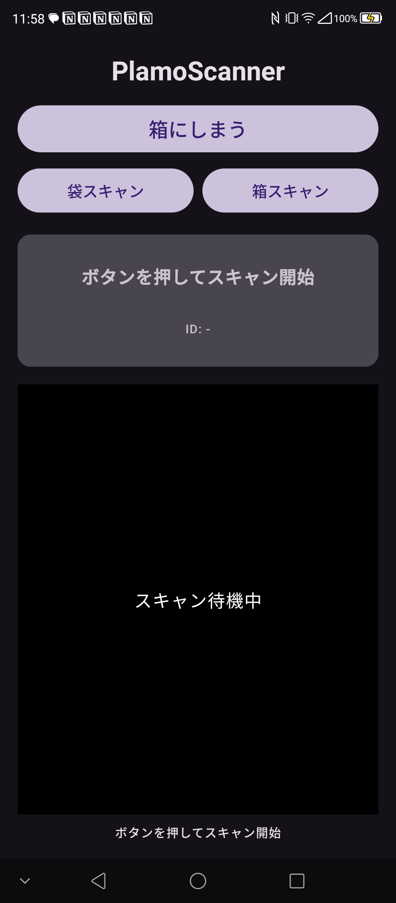
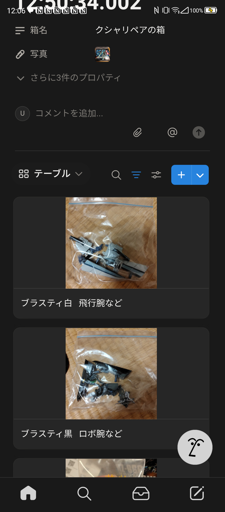

# QR Tidy 📦

**QRコードで「仕舞いたいもの」を管理するアプリ**

物や袋（仕舞うもの）と箱（仕舞う場所）にQRコードを貼り、スキャンするだけで「何をどこに仕舞ったか」をNotionデータベースに自動記録します。プラモデルの余剰パーツ、工具、文具、季節の衣類——何でも整理できます。
元々袋を箱に仕舞う目的で作りましたが、書籍/雑誌のバーコードもスキャン出来るようになり、例えば本棚にQRを貼って、どの本棚に入っているかも管理できるようになりました。書籍単体のスキャンでも持っている簡易的な蔵書管理に使えます。

  

## QRコード生成ツール (QRprint)

[QRprint](./QRprint/) フォルダに、QRコードラベルをPDFとして生成する Python スクリプトが含まれています。

- `generate_qr_labels.py` を実行すると、**A4用紙 4×11 = 44枚分のQRラベル** を1ページのPDFに生成します。
- 生成されたPDFをラベルシールに印刷し、袋や箱に貼って使います。
- サンプルPDF (`qr_labels_sheet_20260211_125034.pdf`) も同梱されているので、そのまま印刷してすぐに使えます。

**実行方法:**
```shell
pip install qrcode reportlab Pillow
python QRprint/generate_qr_labels.py
```

## 使い方

1. **QRシールを印刷する** — 上記の QRprint でPDFを生成し、ラベルシールに印刷。
2. **シールを貼る** — 仕舞いたいもの（物や袋）と、仕舞う場所（箱）にそれぞれ貼る。
3. **「箱にしまう」をタップ** — カメラが起動するので、**箱 → 物** の順にQRコードをスキャンする。
4. **Notionに自動記録** — Notionにレコードが作成/更新され、箱のページが自動で開く。
5. **Notionで詳細を編集** — 箱の名前、中身の写真、メモなどを自由に追記。

### その他の機能

| 機能 | 説明 |
|:---|:---|
| **物スキャン** | 物（袋や書籍など）のQR/バーコードをスキャンして情報登録。APIから詳細を自動取得。 |
| **箱スキャン** | 箱のQRをスキャンして情報確認。未登録なら自動作成。 |
| **NFC対応** | Android版ではNFCタグ（RFID）にも対応。QRとNFCを同時に待ち受け。 |
| **写真撮影** | スキャン時に写真を撮影し、Notionページに自動アップロード。 |

## Notionデータベース構成

アプリが連携するNotionデータベースには、以下の最低限の項目が必要です。写真やメモなどの列は自由に追加してください。

### 物マスター
| プロパティ | 型 | 説明 |
|:---|:---|:---|
| **物ID** | Title | QRコードの文字列（PK） |
| **カテゴリ** | Rich Text | "書籍" または "雑誌" (API取得時) その他は空欄なので必要に応じて手入力してください|
| **物名** | Rich Text | 中身の名称 (API取得時はタイトル) |
| **詳細** | Rich Text | 書籍の概要など (API取得時) |
| **補足情報** | Rich Text | 著者、出版社、価格、出版日、ISBNなど (API取得時) |
| **現在の箱** | Relation | 箱マスターへのリンク |
| **写真** | Files | 書籍の表紙画像(API) または 撮影画像 |

### 箱マスター
| プロパティ | 型 | 説明 |
|:---|:---|:---|
| **箱ID** | Title | QRコードの文字列（PK） |
| **箱名** | Rich Text | 収納場所の名称 |
| **写真** | Files | スキャン時に撮影した画像（自動アップロード） |

> **Tip:** 物マスターの「現在の箱」リレーションを**双方向**にしておくと、箱のページに中身の一覧が表示されて便利です。

## プロジェクト構成

**Kotlin Multiplatform (KMP)** + **Compose Multiplatform** で構築されたクロスプラットフォームアプリです。

```
QRTidy/
├── composeApp/
│   └── src/
│       ├── androidMain/    ← Android版ソース（CameraX, Retrofit, NFC）
│       ├── iosMain/        ← iOS版ソース（準備中）
│       ├── commonMain/     ← 共通コード
│       └── jvmMain/        ← Desktop版（準備中）
├── iosApp/                 ← Xcode プロジェクト
└── QRprint/                ← QRコードラベル生成ツール
```

## セットアップ

### 1. Notion の準備

1. [Notion Integrations](https://www.notion.so/my-integrations) でインテグレーションを作成し、**Internal Integration Secret** を取得。
2. 上記の構成で袋マスター・箱マスターのデータベースを作成。
3. 各データベースのページで「コネクト」からインテグレーションを追加してアクセス権を付与。

### 2. シークレットファイルの作成

`SecretConfig.kt.sample` をコピーして `SecretConfig.kt` を作成し、実際の値を設定します。

```
composeApp/src/androidMain/kotlin/dev/unafi/qrtidy/SecretConfig.kt
```

```kotlin
package dev.unafi.qrtidy

object SecretConfig {
    const val NOTION_API_KEY = "ntn_あなたのキー"
    const val DATABASE_ID_HUKURO = "袋マスターのDB ID (32桁)"
    const val DATABASE_ID_HAKO = "箱マスターのDB ID (32桁)"
}
```

> **Note:** `SecretConfig.kt` は `.gitignore` に含まれており、リポジトリにはpushされません。

### 3. Android版のビルドと実行

**必要なもの:** Android Studio, Android実機（カメラ・NFC搭載）

1. Android Studio で `QRTidy` プロジェクトを開く。
2. Gradle Sync を実行。
3. 実機を接続し、Run ▶ で実行。

**コマンドラインでビルド:**
```shell
# Windows
.\gradlew.bat :composeApp:assembleDebug

# macOS/Linux
./gradlew :composeApp:assembleDebug
```

### 4. iOS版のビルドと実行（Mac必須）

App Store公開アプリではないため、Xcodeを使って自分のiPhoneにインストールする「サイドロード（野良アプリ）」としてのビルド手順です。

**必要なもの:** Mac, Xcode, Apple ID（無料のApple DeveloperアカウントでOK）, iPhone

1. **リポジトリのクローン**:
   ```bash
   git clone https://github.com/unafi/QRTidy.git
   cd QRTidy
   ```

2. **SecretConfigの作成（iOS用）**:
   iOS版用の設定ファイルを作成します。内容はAndroid版と同じで構いません。
   
   作成場所:
   ```
   composeApp/src/iosMain/kotlin/dev/unafi/qrtidy/SecretConfig.kt
   ```
   
   コード内容（dev.unafi.qrtidyパッケージ）:
   ```kotlin
   package dev.unafi.qrtidy

   object SecretConfig {
       const val NOTION_API_KEY = "ntn_あなたのキー"
       const val DATABASE_ID_HUKURO = "袋マスターのDB ID"
       const val DATABASE_ID_HAKO = "箱マスターのDB ID"
   }
   ```

3. **Xcodeプロジェクトを開く**:
   Finderで `iosApp` フォルダ内の `iosApp.xcodeproj` をダブルクリックしてXcodeで開きます。

4. **署名（Signing）の設定**:
   実機で動かすために、あなたのApple IDを使ったコード署名が必要です。
   - 左側のナビゲーションで一番上の青いアイコン `iosApp` を選択。
   - 中央の画面で `TARGETS` リストから `iosApp` を選択。
   - 上部のタブから **Signing & Capabilities** を開く。
   - **Team**: 「Add an Account...」を選択して自分のApple IDでログインし、自分のチーム（Personal Team）を選択する。
   - **Bundle Identifier**: もしエラー（一意でない等）が出る場合、末尾に自分の名前を入れるなどして変更する（例: `com.example.qrtidy`）。

5. **ビルドと実行**:
   - iPhoneをMacにUSBケーブルで接続する。
   - iPhone側で「このコンピュータを信頼しますか？」と出たら「信頼」をタップ。
   - Xcode上部のデバイス選択メニューから、自分のiPhoneを選択。
   - `Cmd + R` キー、または左上の ▶ ボタンを押してビルド開始。
   - 初回ビルドには数分かかります。
   
   > **Note:** もしビルドエラー（Command PhaseScriptExecution failedなど）が出た場合、メニューの `Product` > `Clean Build Folder` (`Cmd + Shift + K`) を実行してから再試行してください。

6. **iPhone側での信頼設定**:
   - アプリがインストールされても、初回はセキュリティ制限により起動できません。
   - iPhoneの **設定 > 一般 > VPNとデバイス管理**（またはプロファイルとデバイス管理）を開く。
   - 「デベロッパAPP」の下にある自分のメールアドレスを選択。
   - 「"..."を信頼」をタップして許可する。
   - ホーム画面からQRTidyのアイコンをタップして起動できます。

## 技術スタック

| カテゴリ | 技術 |
|:---|:---|
| **言語** | Kotlin (KMP) |
| **UI** | Jetpack Compose / Compose Multiplatform (Material3) |
| **カメラ / QR** | Android: CameraX + ML Kit <br> iOS: AVFoundation (Native) |
| **NFC** | Android: NfcAdapter (Reader Mode) |
| **通信** | Android: Retrofit2 + OkHttp <br> iOS: Ktor Client (Darwin) |
| **バックエンド** | Notion API (直接通信) |

## 関連プロジェクト

- [PlamoScanner](https://github.com/unafi/PlamoScanner) — 本プロジェクトの前身（Android単体版）
- [PlamoScannerPWA](https://github.com/unafi/PlamoScannerPWA) — PWA版（ブラウザで動作、GAS経由）

## ライセンス

MIT License
