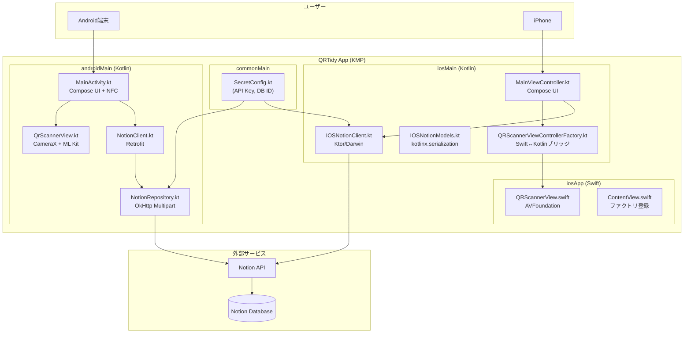
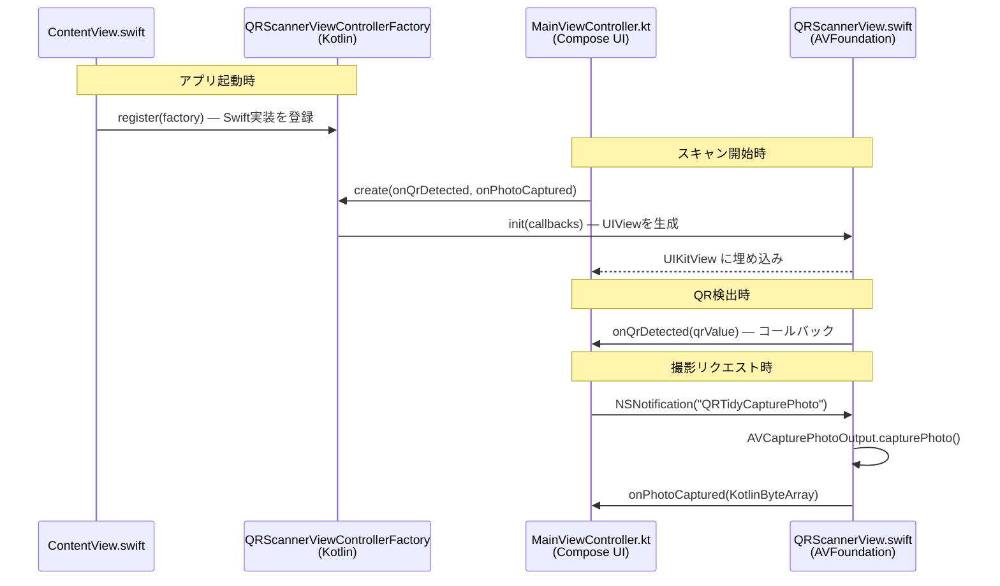
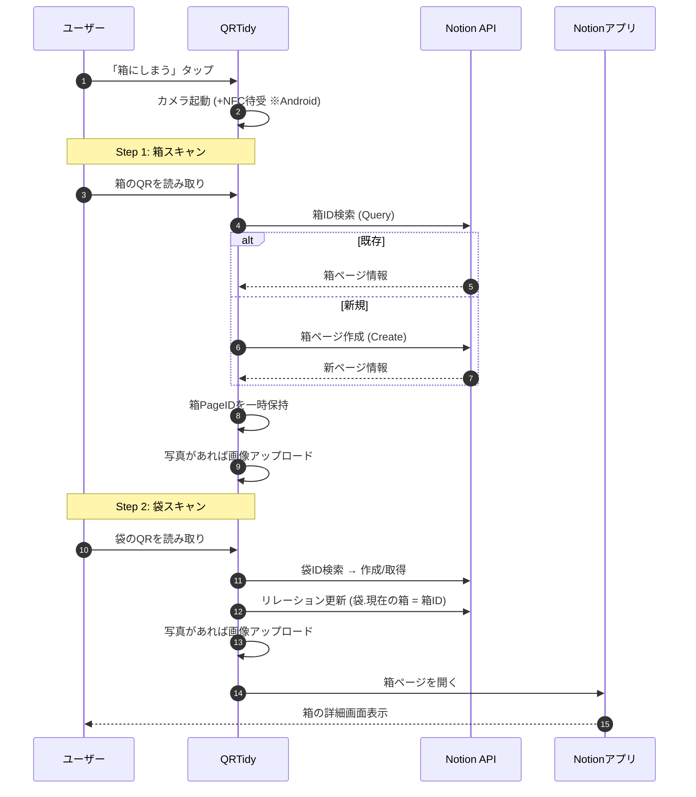
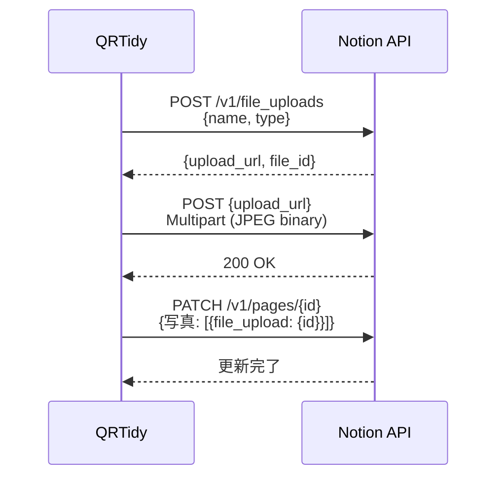

# QRTidy 技術仕様書

## 1. システム概要

QRTidyは、QRコードを貼った「モノ（袋）」と「場所（箱）」をスキャンして紐付け、Notionデータベースで管理するクロスプラットフォームアプリです。

**Kotlin Multiplatform (KMP)** + **Compose Multiplatform** を採用し、Android/iOSの2プラットフォームを単一リポジトリで開発しています。

### 前身プロジェクトとの関係

| プロジェクト | プラットフォーム | 通信方式 | 状態 |
|:---|:---|:---|:---|
| [PlamoScanner](https://github.com/unafi/PlamoScanner) | Android専用 | アプリ → Notion API 直接 | QRTidyに移行 |
| [PlamoScannerPWA](https://github.com/unafi/PlamoScannerPWA) | ブラウザ (PWA) | ブラウザ → GAS → Notion API | 運用中 |
| **QRTidy** | **Android + iOS (KMP)** | **アプリ → Notion API 直接** | **現行版** |

---

## 2. アーキテクチャ

### 2.1. 全体構成



### 2.2. プラットフォーム別の実装分担

| 機能領域 | commonMain (共通) | androidMain | iosMain / iosApp |
|:---|:---|:---|:---|
| **設定値** | `SecretConfig.kt` ✅ | — | — |
| **UI** | — | `MainActivity.kt` (Compose) | `MainViewController.kt` (Compose) |
| **QRスキャン** | — | CameraX + ML Kit | AVFoundation (Swift) |
| **NFC** | — | `NfcAdapter` (Reader Mode) | ❌ 非対応 |
| **写真撮影** | — | CameraX `ImageCapture` | `AVCapturePhotoOutput` (Swift) |
| **画像加工** | — | `Bitmap` 回転・クロップ | `UIImage` 正方形クロップ |
| **Notion通信** | — | Retrofit + OkHttp + Gson | Ktor (Darwin) + kotlinx.serialization |
| **アプリ連携** | — | `Intent` (Notionアプリ) | `UIApplication.openURL` |

> **設計判断**: Notion通信ライブラリを共通化せず、Android は Retrofit / iOS は Ktor とした理由は、既存の Retrofit 実装（特に非公式 `file_uploads` API の Multipart 送信）を書き直すリスクを避けるため。通信ロジックは各 240行程度と小さく、コピーコストも低い。

---

## 3. Swift ↔ Kotlin ブリッジ設計

iOS版のカメラ機能は AVFoundation (Swift) で実装する必要があるため、**ファクトリパターン + NSNotification** で Kotlin と Swift を橋渡ししています。



### データ変換の流れ（撮影画像）

```
[iOS] AVCapturePhoto → Data → UIImage → cropToSquare() → JPEG(70%) → KotlinByteArray
                                                                            ↓
[Kotlin] ByteArray → SkiaImage → ComposeImageBitmap (プレビュー表示)
                   → Ktor Multipart Upload (Notionへ送信)
```

---

## 4. スキャン制御ロジック

### 4.1. Android版: ハイブリッドスキャン

NFC と QRコードを**同時に待ち受け**、先に検出した方を採用します（先勝ち方式）。

- **NFC**: `NfcAdapter.enableReaderMode` でタグ検出時にコールバック
- **QR**: CameraX + ML Kit Vision でフレーム毎に解析
- **排他制御**: `isLocked` フラグでどちらか検出後にロックし二重読み取りを防止

### 4.2. iOS版: QRスキャン専用

QRコードスキャンのみ対応（NFC非対応）。

- **QR**: `AVCaptureMetadataOutput` でリアルタイム検出
- **排他制御**: `isProcessing` フラグで二重検出を防止
- **検出音**: `AudioServicesPlaySystemSound(1108)` でフィードバック

---

## 5. ユーザー操作フロー

### 5.1. 「箱にしまう」（メインフロー）



### 5.2. 袋/箱スキャン（単体）

QRをスキャンし、対象のNotionページを開く。未登録の場合は自動作成。

---

## 6. 画像アップロード

Notion の非公式ファイルアップロードAPI (`v1/file_uploads`) を使用しています。



| 処理 | Android | iOS |
|:---|:---|:---|
| 画像取得 | CameraX `ImageCapture` | `AVCapturePhotoOutput` |
| 加工 | Bitmap 回転 + 正方形クロップ | `UIImage.cropToSquare()` |
| 圧縮 | JPEG 品質70% | JPEG 品質70% |
| 送信 | OkHttp `MultipartBody` | Ktor `MultiPartFormDataContent` |

---

## 7. 環境設定とシークレット管理

### SecretConfig.kt

`commonMain` に配置。`.gitignore` で Git 管理外。`SecretConfig.kt.sample` をリポジトリに同梱。

```kotlin
package dev.unafi.qrtidy

object SecretConfig {
    const val NOTION_API_KEY = "ntn_..."       // Notion Integration Token
    const val DATABASE_ID_HUKURO = "..."       // 袋マスター DB ID (32桁)
    const val DATABASE_ID_HAKO = "..."         // 箱マスター DB ID (32桁)
}
```

### Info.plist (iOS固有)

```xml
<key>NSCameraUsageDescription</key>
<string>QRコードのスキャンと写真撮影にカメラを使用します</string>
<key>UISupportedInterfaceOrientations</key>
<array><string>UIInterfaceOrientationPortrait</string></array>
```

---

## 8. ビルドと依存関係

### 8.1. 主要ライブラリ

| ライブラリ | バージョン | 用途 | プラットフォーム |
|:---|:---|:---|:---|
| Compose Multiplatform | 1.10.0 | UI フレームワーク | 共通 |
| Kotlin | 2.3.0 | 言語 | 共通 |
| Retrofit | 2.9.0 | HTTP クライアント | Android |
| OkHttp | 4.11.0 | HTTP / ログ | Android |
| CameraX | 1.3.4 | カメラ | Android |
| ML Kit Barcode | 17.3.0 | QR検出 | Android |
| Ktor Client (Darwin) | 3.1.1 | HTTP クライアント | iOS |
| kotlinx.serialization | 1.8.0 | JSON シリアライゼーション | iOS |

### 8.2. ビルドコマンド

```shell
# Android APK
./gradlew :composeApp:assembleDebug

# iOS Framework (実機)
./gradlew :composeApp:linkDebugFrameworkIosArm64

# iOS Framework (シミュレータ)
./gradlew :composeApp:linkDebugFrameworkIosSimulatorArm64
```

---
*Document generated by Antigravity Assistant*
